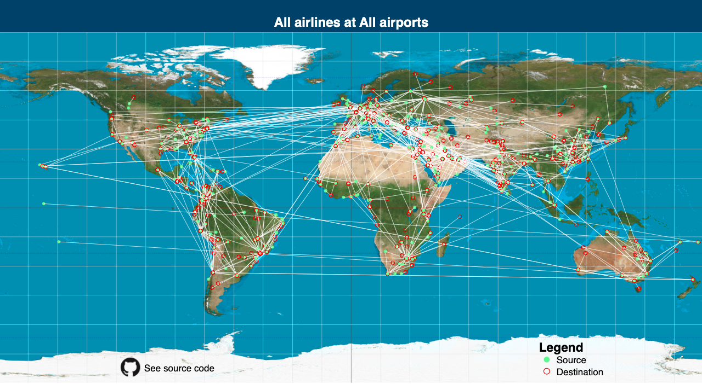

This project was bootstrapped with [Create React App](https://github.com/facebook/create-react-app).

## What is it?
1. A React-based toy app to see airline routes across major airlines and airports
2. Select an Airline or Airport to further filter
3. Click on an Airport to also filter by airport

## How to run in development mode
1. Run `npm install`
2. Run `npm start`
3. Go to [http://localhost:3000/](http://localhost:3000/)